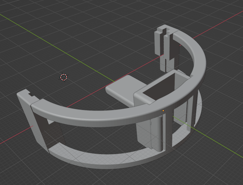
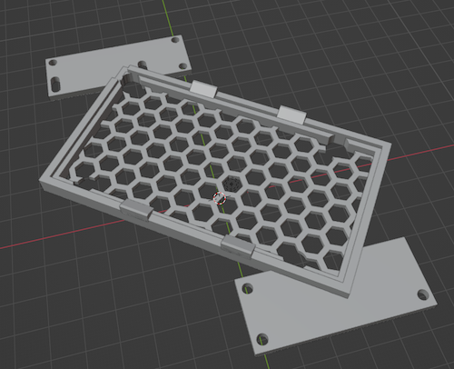

# Rhino Robots 3D Models

This repository contains 3D models for Rhino Robots. They are free for any and all use.

### Arduino MM6 Wire Clamp

, , , [YouTube video](https://www.youtube.com/watch?v=22EeDbbwtAY)

This clamp comes in two parts: A plug that holds the wire ribbon cables into their sockets and a set of arches that clamp the plug to the MM6 PCB. A channel runs between the plug and the arches to route the ribbon cables out to the back of the board. Print three for each MM6 PCB. No fasteners required.

### XR2 Arduino Mount

, , [YouTube video](https://www.youtube.com/watch?v=4HOXKobwqGA)

For the XR2 Arduino Mount, you'll want to replace the eight existing socket caps (the hex bolts) with slightly longer ones. Bolt Depot part number 22746 stainless steel 18-8 black oxide finish, #6-32 x 1/2" socket caps are used with this design. I have no affiliation with Bolt Depot.

## Rhino Robots

Sandhu Machine Design Inc. of Champaign, Illinois produced a [series](http://www.theoldrobots.com/rhinoarm.html) of servo-controlled Rhino Robots in the 1980s. These robots were scaled down versions of their industrial counterparts (less expensive and less poweful). They were great for teaching and made their way into many instructional courses on robotics.

Today you may find them at government auctions, on eBay, or collecting dust in a closet at your local university's engineering lab.

## Software 

See [Rhino Arduino MM6](https://github.com/petermcd1010/rhino_arduino_mm6) for the robot control software running on the arduino.

Have fun!

