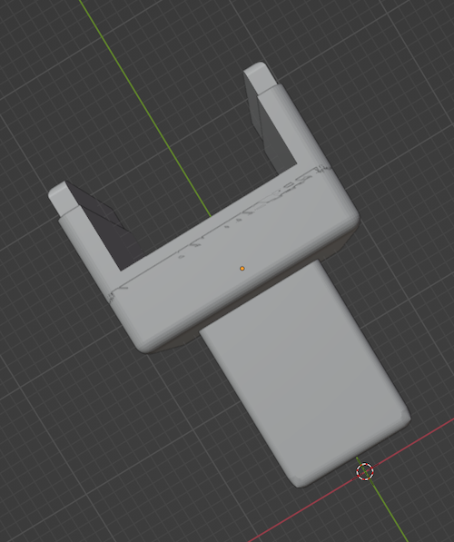

# Rhino Robots 3D Models

This repository contains 3D models for use with Rhino Robots. They are free for any and all use.

## Rhino Robots

Sandhu Machine Design Inc. of Champaign, Illinois produced a [series](http://www.theoldrobots.com/rhinoarm.html) of servo-controlled Rhino Robots in the 1980s. These robots were scaled down versions of their industrial counterparts (less expensive and less poweful). They were created for education, research, and industrial training.

Today you may find them at government auctions, on eBay, or collecting dust in a closet at your local university's engineering lab.

### Raspberry Pi 4 with PoE or PoE+ Hat

These 3D-printed Raspberry Pi 4 enclosures fit a Raspberry Pi 4 with a PoE or PoE+ hat. By default, the hats do not make the GPIO pins accessible. To address this, these designs require you to sandwich two extra tall 40-pin and 4-pin header blocks between the Raspberry Pi and the hat. You can purchase the "4 & 40 Pin Extra Tall Header (Push Fit Version) - POE HAT Set" from PiShop.us. You will need to clip the 4-pin header pins for the PoE+ hat to the correct length (I guessed and was lucky). The older PoE hat does not require clipping.

Also print the four Raspberry Pi 4 Spacer Pins below and insert them between the Raspberry Pi 4 and the hat. These pins provide stability to the boards and also lock them into the enclosure once it's closed.

To insert the hexagonal M3 nuts into the base, do not try to press them in by hand. Instead, slide an M3 screw through from the other side, attach the nut, then tighten the screw to pull the nut into the hole.

### Raspberry Pi 4 base for XR-1

, 

For the XR-1's RPi4 base, replace the two #6-32x3/8” fasteners along bottom plate of the robot shoulder with longer ones. Bolt Depot 22746 stainless steel 18-8 black oxide finish #6-32x1/2" socket caps work well. Also replace the #6-32x1/2” fastener located at center of the XR-1 shoulder joint with a #6-32x3/4” fastener (Bolt Depot 22748). For best strength, place a steel washer (Bolt Depot 22027) between the top of the fastener and the top of the printed plastic mount.

### Raspberry Pi 4 base for XR-1 with Google Coral USB TPU mount

, 

Follow the same instructions as the mount without the TPU, but insert four additional M3 hex nuts into the back of the base below the TPU. Then fasten the TPU to the base with four M3x12 fasteners.

### Raspberry Pi 4 base for XR-2 and XR-3

, 

For the XR-2 and XR-3's RPi4 base, replace the two #6-32x3/8” fasteners along bottom plate of the robot shoulder with longer ones. Bolt Depot 22746 stainless steel 18-8 black oxide finish #6-32x1/2" socket caps work well. Also replace the #10-24x3/8” fastener located at the top left of the enclosure base with a #10-24x5/8” fastener (Bolt Depot 22757).

### Raspberry Pi 4 base for XR-2 with Google Coral USB mount

, 

Follow the same instructions as the mount without the TPU, but insert four additional M3 hex nuts into the back of the base below the TPU. Then fasten the TPU to the base with four M3x12 fasteners.

### Raspberry Pi Base (Plain)

, 

This base without Rhino Robot mount points is provided here for reference.

### Raspberry Pi 4 Spacer Pins

, 

Print one set of four spacer pins for each RPi 4. Sandwich them between the RPi 4's base PCB and the PoE or PoE+ hat's PCB. The pins on the end of the spacer lock the PCBs into the base and top of the Raspberry Pi 4 enclosure.

### Raspberry Pi 4 PoE Hat Top

, 

Fasten the top to the base with four M3x16 fasteners.

### Raspberry Pi 4 PoE+ Hat Top

, 

Fasten the top to the base with four M3x16 fasteners.

### Intel Realsense Depth Camera Mount ###

, , 

Assembly requires one #6 hexagonal nut (Bolt Depot 22012), one #6-32x1/2" fastener (Bolt Depot 22746), one M3 hexagonal nut, two M3x6 fasteners, and one M3x12 fastener. 

Print using standard settings (15% gyroid infill).

Before attaching the Realsense Rhino Mount Plate to the robot, install the #6 hexagonal nut in the bottom of the 3D-printed mount. Do not try to press the nut into the hexagonal hole by hand. Instead, slide the #6-32x1/2" fastener through from the other side of the mount, attach it to the hexagonal nut, then tighten the fastener to pull the nut into the hexagonal hole. The #6 nut should now be held in place by friction. Remove the #6-32x1/2" fastener. 

Before attaching the Intel Realsense camera to the Realsense Stem, install an M3 hexagonal nut into the front of the 3D-printed stem. Do not try to press the nut into the hexagonal hole by hand. Instead, slide the M3x12 fastener through from the other side, attach it to the hexagonal nut, then tighten the fastener to pull the nut into the hexagonal hole. The M3 nut should now be held in place by friction. Remove the M3x12 fastener. 
Attach the Intel Realsense camera to the Realsense Stem with the two M3x6 fasteners. Set the Realsense Stem aside until the Realsense Rhino Mount Plate has been attached to the robot.

To attach the Realsense Rhino Mount plate to the robot, first remove the A-motor from the robot’s hand (this is the motor used to open and close the gripper). 
Next press the Realsense Rhino Mount plate into the metal plate on the front of the robot's wrist. It is a tight fit that may take some patience. 
Once the Realsense Rhino Mount plate has been installed, replace the #6-32x1/4” fastener in the center of the metal plate on the front wrist with the longer #6-32x1/2” fastener. This fastener will be long enough to go through the aluminum wrist plate to fasten into the #6 hexagonal nut you installed into the bottom of the Realsense Rhino Mount plate.

Once the above steps are complete, slide the Realsense Stem onto the Realsense Rhino Mount Plate. Screw an M3x12 fastener through the hole in the Realsense Stem on the back side of the camera mount into the M3 hex nut you installed into the back of the vertical stem protruding from the Realsense Mount Plate that you installed above.

### Arduino Base for XR-1

, 

For the XR-1's arduino base, you should replace four socket caps (hex bolts) with longer ones. Bolt Depot part number 22746 stainless steel 18-8 black oxide finish, #6-32 x 1/2" socket caps work well.

### Arduino Base for XR-2 and XR-3

, , [YouTube video](https://www.youtube.com/watch?v=4HOXKobwqGA)

For the XR-2 and XR-3's arduino base, you should replace eight socket caps (hex bolts) with longer ones. Bolt Depot part number 22746 stainless steel 18-8 black oxide finish, #6-32 x 1/2" socket caps work well.

### Arduino Base for SCARA Arm

, , [YouTube video](https://www.youtube.com/watch?v=ZgXrVDasyXI)

The geometry of the SCARA Arm's base required printing with 100% infill and tree supports.

### Arduino Base for XR-4

, 

For the XR-4's arduino base, you should replace five socket caps (hex bolts) with longer ones.
For the top left socket cap, you can use a Bolt Depot part number 22746 stainless steel 18-8 black oxide finish, #6-32 x 1/2" socket cap.
For the other four, you can use Bolt Depot part number 22757 stainless steel 18-8 black oxide finish, #10-24 x 5/8" socket caps.

### Arduino MegaMotor6 Arches

, , [YouTube video](https://www.youtube.com/watch?v=22EeDbbwtAY)

Each arch (together with a plug from below) holds the motor ribbon cables into their sockets and provides a channel to route the ribbon cable to the back of the board. Print three for each MM6 PCB. No fasteners required.

### Arduino MM6 Plug for XR-1

, 

This plug is sized for the shorter ribbon cable plugs on the XR-1. Print three for each MM6 PCB. No fasteners required.

### Arduino MM6 Plug for XR-1, XR-4, and SCARA

, 

This plug is sized for the longer ribbon cable plugs on models after the XR-1. Print three for each MM6 PCB. No fasteners required.

## Software 

See [Rhino Arduino MM6](https://github.com/petermcd1010/rhino_arduino_mm6) for the robot control software running on the arduino.

Have fun!

