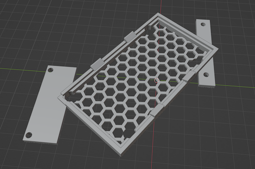

# Rhino Robots 3D Models

This repository contains 3D models for use with Rhino Robots. They are free for any and all use.

## Rhino Robots

Sandhu Machine Design Inc. of Champaign, Illinois produced a [series](http://www.theoldrobots.com/rhinoarm.html) of servo-controlled Rhino Robots in the 1980s. These robots were scaled down versions of their industrial counterparts (less expensive and less poweful). They were created for education, research, and industrial training.

Today you may find them at government auctions, on eBay, or collecting dust in a closet at your local university's engineering lab.

### Arduino MM6 Arches

, , [YouTube video](https://www.youtube.com/watch?v=22EeDbbwtAY)

Each arch (together with a plug from below) holds the motor ribbon cables into their sockets and provides a channel to route the ribbon cable to the back of the board. Print three for each MM6 PCB. No fasteners required.

### Arduino MM6 Plug for XR-1

, 

This plug is sized for the shorter ribbon cable plugs on the XR-1. Print three for each MM6 PCB. No fasteners required.

### Arduino MM6 Plug for models other than XR-1

, 

This plug is sized for the longer ribbon cable plugs on models after the XR-1. Print three for each MM6 PCB. No fasteners required.

### Arduino Base for XR-1

, 

For the XR-1's arduino base, you should replace four socket caps (hex bolts) with longer ones. Bolt Depot part number 22746 stainless steel 18-8 black oxide finish, #6-32 x 1/2" socket caps work well.

### Arduino Base for XR-2

, , [YouTube video](https://www.youtube.com/watch?v=4HOXKobwqGA)

For the XR-2's arduino base, you should replace six socket caps (hex bolts) with longer ones. Bolt Depot part number 22746 stainless steel 18-8 black oxide finish, #6-32 x 1/2" socket caps work well.

### Arduino Base for SCARA Arm

, , [YouTube video](https://www.youtube.com/watch?v=ZgXrVDasyXI)

The geometry of the SCARA Arm's base required printing with 100% infill and tree supports.

### Arduino Base for XR-4

, 

For the XR-4's arduino base, you should replace five socket caps (hex bolts) with longer ones.
For the top left socket cap, you can use a Bolt Depot part number 22746 stainless steel 18-8 black oxide finish, #6-32 x 1/2" socket cap.
For the other four, you can use Bolt Depot part number 22757 stainless steel 18-8 black oxide finish, #10-24 x 5/8" socket caps.

## Software 

See [Rhino Arduino MM6](https://github.com/petermcd1010/rhino_arduino_mm6) for the robot control software running on the arduino.

Have fun!

